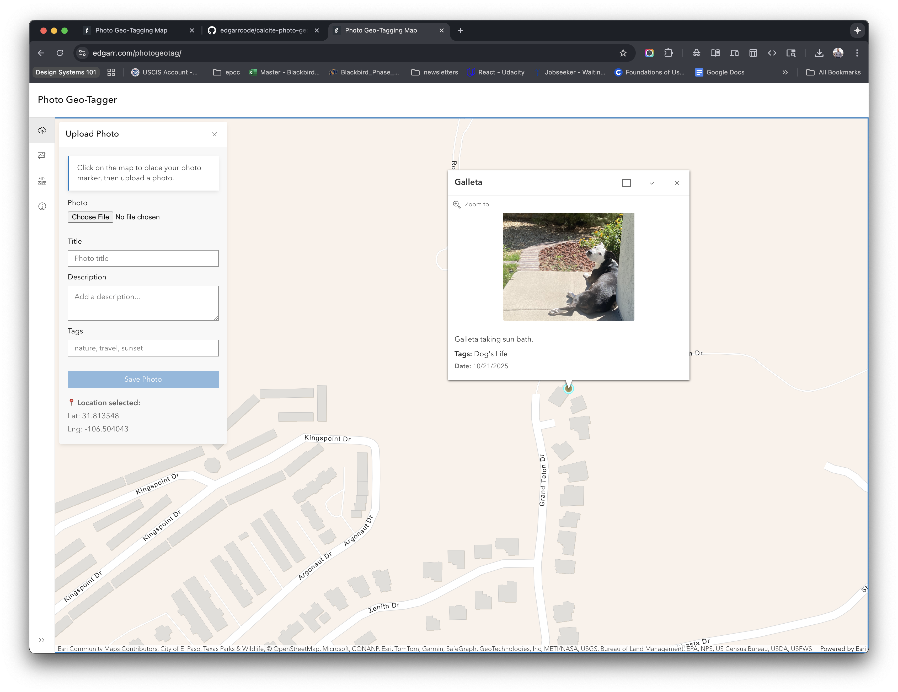

# Photo Geo-Tagger 📸

A web-based mapping application that allows users to geotag photos by selecting locations on an interactive map. Built with Esri's ArcGIS Maps SDK for JavaScript and Calcite Design System.

## ✨ Features

- **Interactive Map:** Click anywhere on the map to set photo locations
- **Photo Upload:** Add photos with titles, descriptions, and tags
- **Photo Gallery:** View all uploaded photos with their metadata
- **Location Markers:** Photos appear as markers on the map with popups showing full details
- **Basemap Options:** Switch between different map styles
- **Responsive Design:** Clean, modern UI using Calcite Components

## 📸 Screenshot


*Add your screenshot image here - replace `screenshot.png` with your image filename*

## 🌐 Live Demo

[View Live Demo](https://edgarr.com/photogeotag/)

## 🛠️ Technologies Used

- **[ArcGIS Maps SDK for JavaScript](https://developers.arcgis.com/javascript/)** - Map rendering and geospatial functionality
- **[Calcite Design System](https://developers.arcgis.com/calcite-design-system/)** - UI components and styling
- **HTML5/CSS3/JavaScript** - Core web technologies
- **Local Storage** - In-memory photo storage (photos reset on page refresh)

## 🚀 Getting Started

### Prerequisites

- A web browser (Chrome, Firefox, Safari, Edge)
- A free [ArcGIS Developer account](https://developers.arcgis.com/sign-up/)
- A web server or local development server (like VS Code Live Server)

### Installation

1. **Clone the repository:**
   ```bash
   git clone https://github.com/yourusername/photo-geo-tagger.git
   cd photo-geo-tagger
   ```

2. **Get an ArcGIS API Key:**
   - Go to [ArcGIS Developer Dashboard](https://developers.arcgis.com/api-keys/)
   - Create a new API key
   - Enable the **Basemaps** privilege
   - Copy your API key

3. **Configure the API Key:**
   - Open `index.html`
   - Find this line:
     ```javascript
     esriConfig.apiKey = "YOUR_API_KEY_HERE";
     ```
   - Replace `YOUR_API_KEY_HERE` with your actual API key

4. **Add HTTP Referrer Protection (Recommended):**
   - In your ArcGIS Dashboard, add your domain to HTTP Referrers
   - Example: `yourdomain.com/*` or `localhost/*` for development

5. **Run the application:**
   - Open `index.html` in a web server (required for ArcGIS SDK)
   - **VS Code:** Right-click → "Open with Live Server"
   - **Python:** `python -m http.server 8000`
   - **Node.js:** `npx serve`

## 📖 How to Use

1. **Upload a Photo:**
   - Click the "Upload Photo" button in the sidebar
   - Click anywhere on the map to select a location
   - Click "Choose File" and select your photo
   - Add a title, description, and tags (optional)
   - Click "Save Photo"

2. **View Gallery:**
   - Click the "Gallery" button to see all uploaded photos
   - Click on any photo in the gallery to zoom to its location on the map

3. **View Photo Details:**
   - Click on any orange marker on the map
   - A popup will display the photo with all its details

4. **Change Basemap:**
   - Click the "Basemaps" button
   - Select from various map styles

## ⚠️ Important Notes

- **Photos are stored in memory only** - they will be lost when you refresh the page
- To persist photos, you would need to implement localStorage or a backend database
- The free ArcGIS tier includes 2 million basemap tiles/month (plenty for personal projects)

## 🔐 Security

- API keys are designed for client-side use but should be protected
- Add HTTP referrer restrictions in your ArcGIS Dashboard
- Monitor your API usage regularly
- Never commit API keys to public repositories (use environment variables in production)

## 🎯 Future Enhancements

- [ ] Persistent storage (localStorage or database)
- [ ] Photo editing and deletion
- [ ] Filter photos by tags or date
- [ ] Export photos with location data
- [ ] Multiple photo upload
- [ ] Clustering for many markers
- [ ] Mobile camera integration

## 📝 Tutorial Reference

This project is based on the [ArcGIS Calcite Design System Tutorial](https://developers.arcgis.com/calcite-design-system/tutorials/create-a-mapping-app/) and adapted for photo geo-tagging functionality.

## 📄 License

This project is open source and available under the [MIT License](LICENSE).

## 🙏 Acknowledgments

- Built with [ArcGIS Maps SDK for JavaScript](https://developers.arcgis.com/javascript/)
- UI components from [Calcite Design System](https://developers.arcgis.com/calcite-design-system/)
- Icons from [Calcite Icons](https://developers.arcgis.com/calcite-design-system/icons/)

## 👤 Author

**Your Name**
- GitHub: [@yourusername](https://github.com/yourusername)
- Website: [edgarr.com](https://edgarr.com)

---

⭐ If you found this project helpful, please give it a star!